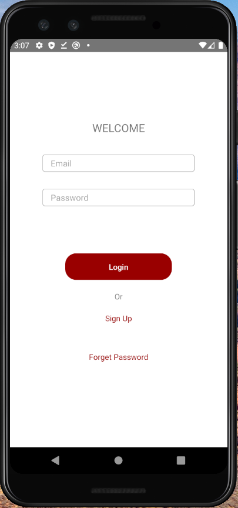

# React Native Todo App

The React Native Todo App revolutionizes task management by combining the power of the MERN stack with the flexibility of React Native. From its robust authentication system and OTP verification to the ease of adding and deleting tasks, this full-stack project empowers users to simplify their lives, increase productivity, and achieve their goals

## Requirements

- Node.js 12.x or higher
- yarn or npm
- Android Studio (For Windows) or Xcode (for MacOS)
- Emulator
- At least 10 GB free disk storage
- 8 GB RAM

## Installation

Install my-project with npm

```bash
  cd todoApp
  yarn or npm Install
  yarn start
  yarn android or yarn ios
```

## Tech Stack

**Client:** React Native, Redux Toolkit, React Native Paper, Axios, React Navigation

**Server:** Node js, Express, Mongoose, bcrypt, cloudinary, jsonwebtoken

## Features

- Auth Flow ( Login , signup, Forget Password)
- Add Task
- Delete Task
- Upload Profile Photo
- Change Password

## Screenshots


